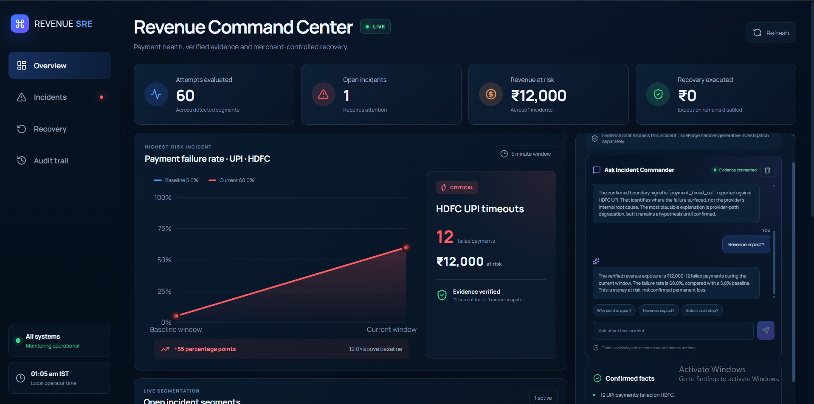
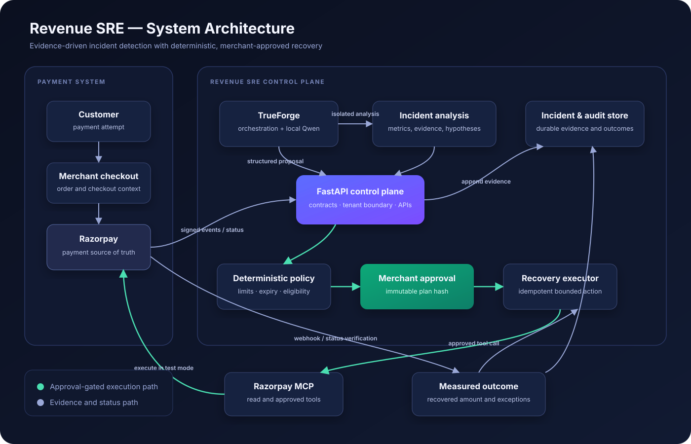

# Revenue SRE

**An evidence-first incident commander for payment failures.**

Revenue SRE watches a merchant's payment stream, detects unusual failure spikes,
calculates the revenue at risk, and gives an operator a safe path from incident
to recovery proposal. It is built for payment and engineering teams that need
more than a list of failed transactions: they need to know whether failures form
an incident, what evidence supports it, and what can be done without making the
problem worse.



## The problem

A single failed payment is usually a customer-level issue. Twelve timeouts on
the same bank and payment method within five minutes can be a revenue incident.
Finding that pattern by manually filtering payment records is slow, and acting
on an incomplete diagnosis can lead to repeated customer contact or unsafe
recovery attempts.

Revenue SRE turns a stream of payment events into an incident-level view:

```text
signed payment events
        -> normalized payment history
        -> deterministic failure-spike detection
        -> exact incident evidence and revenue at risk
        -> TrueForge investigation
        -> bounded recovery proposal
        -> explicit merchant approval or rejection
        -> immutable audit trail
```

## What the MVP demonstrates

- Verifies Razorpay webhook signatures against the original request bytes.
- Stores webhook events and processing jobs atomically in PostgreSQL.
- Processes events through a durable worker with retries and crash recovery.
- Preserves complete event history while preventing out-of-order state regression.
- Detects failure spikes by merchant, payment method, bank, reason, and time window.
- Calculates failure-rate change and money at risk from persisted payment facts.
- Stores the exact facts and metric snapshot that opened each incident.
- Exposes merchant-scoped REST APIs and MCP investigation tools.
- Uses TrueForge and Qwen to investigate incidents and explain facts separately
  from hypotheses.
- Recomputes incident metrics before allowing a recovery proposal.
- Applies deterministic amount, action, expiry, cooldown, and contact limits.
- Requires a separate merchant approval or rejection and records every decision.
- Presents the complete flow in a responsive React command center.

## Architecture

Revenue SRE is outside the payment authorization path. Razorpay remains the
source of payment truth; this service observes events and coordinates incident
response without affecting checkout availability.



| Component | Responsibility |
| --- | --- |
| Razorpay | Test-mode payment events and provider payment state |
| FastAPI | Webhook boundary, merchant isolation, APIs, policy, and approvals |
| PostgreSQL | Inbox, jobs, normalized payments, incidents, evidence, and audit records |
| Worker | Durable event normalization and incident detection |
| Revenue SRE MCP | PII-safe incident, evidence, verification, proposal, and audit tools |
| TrueForge + Qwen | Tool orchestration, investigation, explanations, and proposal rationale |
| React dashboard | Incident health, evidence, advisory chat, approval, and audit views |

The calculations that can authorize or block a workflow are deterministic. The
model can investigate, explain, and propose; it cannot approve a proposal or
directly perform a payment action.

## Incident lifecycle

1. Razorpay sends a webhook to `POST /webhooks/razorpay`.
2. FastAPI validates the signature, deduplicates the provider event, and commits
   both the event and its processing job in one transaction.
3. A worker claims jobs with PostgreSQL `FOR UPDATE SKIP LOCKED`, normalizes the
   payment, and updates current state only when the transition is valid.
4. The detector compares the current window with a historical baseline and opens
   an incident only when all configured thresholds are exceeded.
5. Incident evidence records link the summary back to the exact failed payments
   and the metric snapshot used by the detector.
6. A TrueForge agent reads the incident through MCP, verifies the evidence, and
   separates confirmed facts from unconfirmed causes.
7. The agent may create a bounded proposal. The server derives trusted payment
   IDs and amounts and applies the policy engine before persistence.
8. A merchant approves or rejects the immutable proposal through a separate API.
   The decision and proposal hash are retained in the audit timeline.

## Safety boundaries

- Tenant ownership is checked on every incident, proposal, evidence, and audit query.
- Duplicate webhooks create one event and one processing job.
- LLM output is treated as untrusted input and must pass schema and policy checks.
- Proposal creation is not execution.
- Approval is explicit, merchant-owned, immutable, and bound to the proposal hash.
- Customer email, contact details, API keys, webhook secrets, and authorization
  headers are excluded from logs and agent evidence.
- Financial amounts use integer currency subunits.
- Execution is disabled by default with `EXECUTION_ENABLED=false`.

### Deliberate MVP boundary

The current MVP does **not** claim Razorpay payment-link execution, customer
notification delivery, or recovered-revenue attribution. Daytona could not be
configured during the event, so evidence verification uses an explicit
deterministic MCP fallback and reports
`native_trueforge_sandbox_used: false`. No fallback is presented as native
sandbox execution.

## Technology

| Area | Stack |
| --- | --- |
| API and domain | Python 3.12+, FastAPI, Pydantic |
| Persistence | PostgreSQL 16, SQLAlchemy, Alembic |
| Background processing | PostgreSQL transactional inbox and worker leases |
| Agent integration | TrueForge, MCP, self-hosted Qwen via an OpenAI-compatible API |
| Frontend | React 19, TypeScript, Vite, TanStack Query, Recharts, Motion |
| Quality | pytest, Ruff, Oxlint, TypeScript, Qodo PR review |
| Local runtime | Docker Compose and PowerShell/WSL2 |

## Repository map

```text
backend/app/api/                 HTTP routes and tenant boundaries
backend/app/database/            models, repositories, and session management
backend/app/services/            normalization, detection, policy, and recovery logic
backend/app/workers/             durable processing runtime and health reporting
backend/app/mcp/                 Revenue SRE MCP tools exposed to TrueForge
backend/migrations/              PostgreSQL schema migrations
backend/tests/                   unit, integration, isolation, and failure-path tests
frontend/src/                    React command center
trueforge/                       agent instructions and optional investigation skill
docs/                            architecture, threat model, and operational notes
demo/                            presentation whiteboard and video assets
```

## Run locally

### Prerequisites

- Python 3.12 or 3.13
- Docker Desktop
- Node.js and pnpm
- A Razorpay test-mode key pair and webhook secret for provider testing

### 1. Configure the project

```powershell
git clone https://github.com/siddharthjha123/revenue-sre.git
cd revenue-sre
Copy-Item .env.example .env
```

Set a database password, `MERCHANT_ID`, `RAZORPAY_ACCOUNT_ID`, and
`RAZORPAY_WEBHOOK_SECRET` in `.env`. Do not commit that file.

### 2. Install the backend and migrate the database

```powershell
python -m venv venv
.\venv\Scripts\Activate.ps1
python -m pip install -e ".[dev]"
docker compose up -d db
python -m alembic upgrade head
```

### 3. Start the services

Use separate terminals from the repository root:

```powershell
# API
.\venv\Scripts\python.exe -m uvicorn backend.app.main:app --reload

# Durable worker
.\venv\Scripts\revenue-sre-worker.exe

# Revenue SRE MCP
.\venv\Scripts\revenue-sre-mcp.exe

# Frontend
.\frontend\run-dev.ps1
```

The dashboard runs at `http://127.0.0.1:5173`, API documentation at
`http://127.0.0.1:8000/docs`, and the MCP server uses the host and port defined
in `.env`.

### 4. Load the deterministic demonstration

With the API and worker running:

```powershell
.\venv\Scripts\revenue-sre-load-demo.exe
```

The loader submits 150 signed, PII-free Razorpay-format webhooks through the
real ingestion endpoint. It includes healthy control traffic and one segment
whose failure rate moves from 5% to 60%, producing a persistent incident with
₹12,000 at risk.

## Verify the project

```powershell
# Backend
.\venv\Scripts\python.exe -m pytest -v
.\venv\Scripts\python.exe -m ruff check .
.\venv\Scripts\python.exe -m ruff format --check .

# Frontend
Set-Location frontend
pnpm lint
pnpm build
```

## TrueForge integration

The saved TrueForge agent uses a self-hosted Qwen model through an
OpenAI-compatible endpoint and connects to the Revenue SRE MCP server. The MCP
tools let it list incidents, retrieve evidence, verify calculations, create a
non-executing bounded proposal, read proposal status, and explain the audit
timeline. The official Razorpay MCP is a separate connector for real test-mode
provider investigation; synthetic demo payment IDs are never sent to it.

See [the TrueForge workflow](docs/trueforge-mvp.md),
[architecture](docs/architecture.md), [threat model](docs/threat-model.md), and
[webhook design](docs/webhook-ingestion.md) for implementation details.

## License

Released under the [MIT License](LICENSE).
